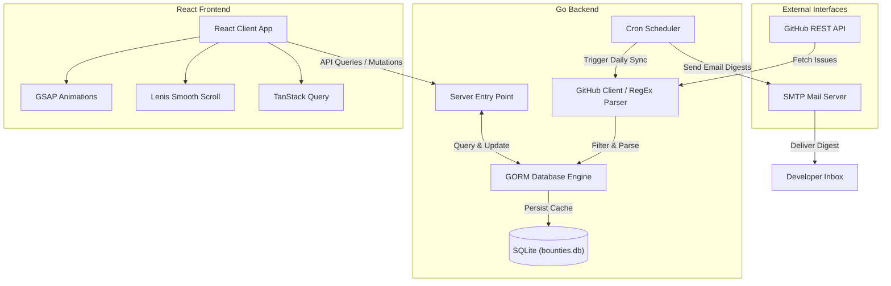

<p align="center">
  
</p>

<p align="center">
  
  
  
  
  
</p>

# Bounty Hub (Bounty Control Center)

> A bioluminescent-inspired control panel for developers to aggregate, search, and track open-source rewards from GitHub.

**Bounty Hub** is a self-hosted dashboard that monitors GitHub issues for rewards (USD, USDC, ETH, etc.), processes bounty amounts via regex filters, caches them locally in a SQLite database, and offers a smooth, animations-rich dashboard to manage your progress from discovery to payment. In addition, it features a background cron service that delivers daily digests of matching bounties directly to your email inbox.

---

## System Architecture

The following diagram illustrates how the GitHub API, Go backend, SQLite cache, SMTP server, and React client interact:



---

## Key Features

*   **Automated Bounty Parsing:** Scans issue titles and descriptions using adaptive RegEx patterns to extract values like `$500 USDC`, `1.5 ETH`, or `250 USD`.
*   **Intelligent Classification:** Auto-tags issue languages (`Go`, `Rust`, `TypeScript`, `Python`) and frameworks based on label markers and text parsing.
*   **Interactive Funnel Tracker:** Track your efforts step-by-step through standard lifecycle stages: `VIEWED` ➔ `RESOLVING` ➔ `SUBMITTED` ➔ `APPROVED` ➔ `PAID`.
*   **Bioluminescent UI Dashboard:** Engineered dark-theme panel complete with high-end GSAP hover micro-interactions, custom scroll easing via Lenis, text-scramble effects, and live stat counters.
*   **SMTP Email Notifications:** Runs a scheduled background cron to auto-sync daily and deliver email summaries of newly discovered matches above your chosen price threshold.

---

## Source Code Map

You can inspect the codebase using the following local links:

*   **Go Server Configurations:**
    *   [backend/main.go](file:///home/rage/Projects/bounty-center/backend/main.go): Sets up endpoint routing, database initialization, CORS configs, and begins the HTTP server.
    *   [backend/github.go](file:///home/rage/Projects/bounty-center/backend/github.go): GitHub API fetching implementation, currency parser, and language categorizer.
    *   [backend/cron.go](file:///home/rage/Projects/bounty-center/backend/cron.go): Coordinates scheduled daily syncing and triggers SMTP email digests.
    *   [backend/db.go](file:///home/rage/Projects/bounty-center/backend/db.go): SQLite schema definitions (e.g. `BountyIssue`, `SavedBounty`, `BountyProgress`, `UserSetting`) and GORM initialization.
*   **React Frontend Application:**
    *   [frontend/src/App.jsx](file:///home/rage/Projects/bounty-center/frontend/src/App.jsx): The main interactive control room workspace, dashboard stats viewer, feed controllers, and settings panel.
    *   [frontend/DESIGN.md](file:///home/rage/Projects/bounty-center/frontend/DESIGN.md): Detailed documentation on colors, typography scale, elements, padding, and aesthetic standards.

---

## Setup & Installation

### 1. Prerequisites
*   **Go** 1.20 or newer
*   **Node.js** 18.x or newer

### 2. Backend Config & Launch
Create a `.env` file inside the `backend` directory (or export directly to your environment):

```env
PORT=8080
DATABASE_URL=bounties.db
GITHUB_PAT=your_github_personal_access_token
EMAIL_SUBSCRIBER=your-email@example.com
SMTP_HOST=smtp.gmail.com
SMTP_PORT=587
SMTP_USER=your-smtp-username
SMTP_PASS=your-smtp-password
```

Run the API server:
```bash
cd backend
go run .
```

### 3. Frontend Config & Launch
Install client dependencies and run the Vite server:
```bash
cd frontend
npm install
npm run dev
```
Open [http://localhost:5173](http://localhost:5173) in your browser to enter the Bounty Hub control room.

---

## Tech Stack

*   **Backend:** Go, [Chi](https://github.com/go-chi/chi), [GORM](https://gorm.io/), SQLite
*   **Frontend:** React, [Vite](https://vitejs.dev/), [GSAP](https://gsap.com/), [Lenis](https://lenis.darkroom.engineering/), [TanStack Query](https://tanstack.com/query), [Lucide React](https://lucide.dev/)
*   **Linting:** [Oxlint](https://github.com/oxc-project/oxc)
